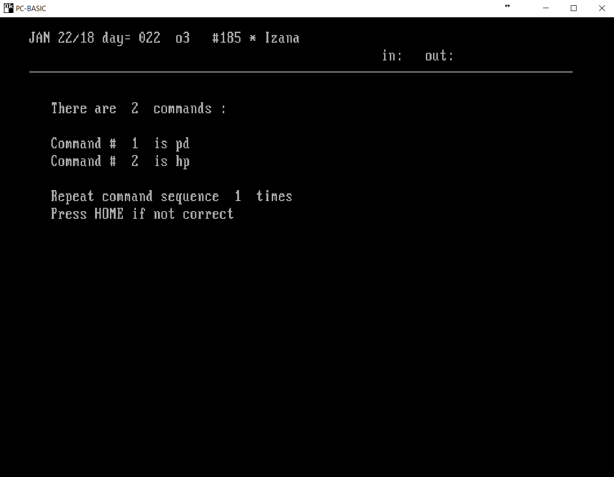
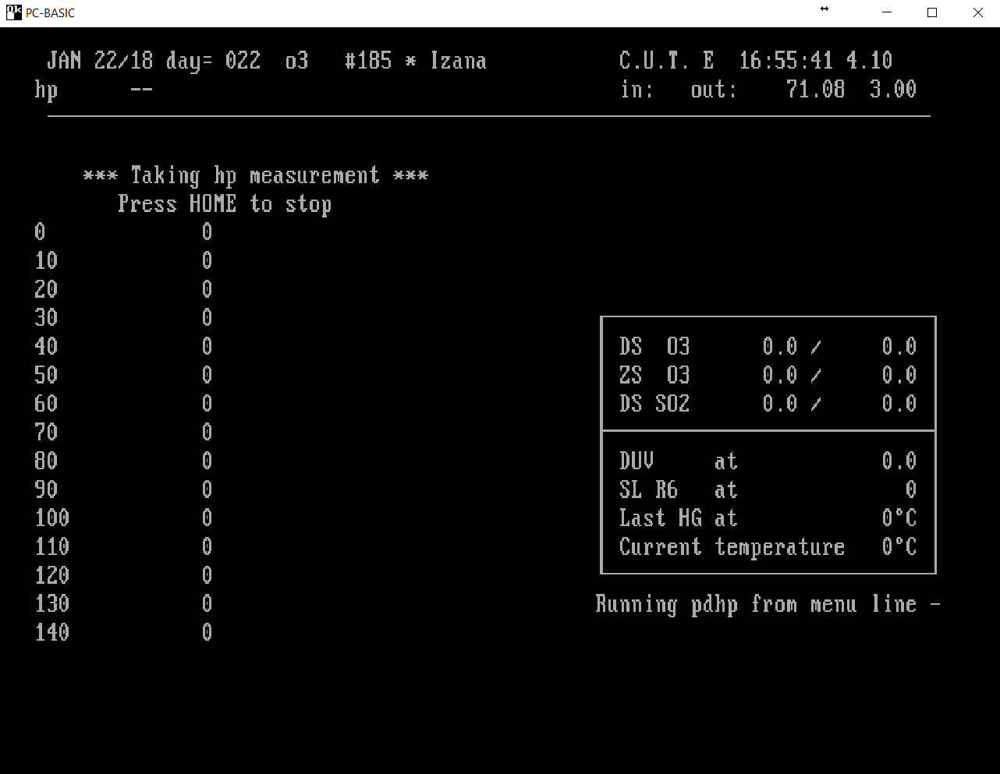
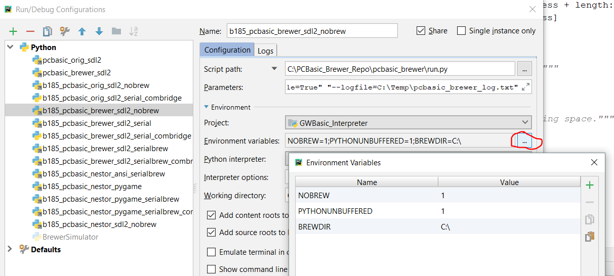

# PCBRW  (PC BASIC Brewer) testing repository
A repository with a fixed version of PCBASIC and the Brewer software, for testing purposes.

Note: This repo is only for personal testing purposes. If you want to control a Brewer in a operational way with PCBASIC, see the instructions to use in this other repo: https://github.com/Danitegue/PCBREWER

PCBASIC is an open source GWBASIC emulator written entirely in Python, by Rob Hagemans. More info here: https://github.com/robhagemans/pcbasic/ and here: http://robhagemans.github.io/pcbasic/doc/

Main programmer: Daniel Santana Díaz.

Principal collaborators: Nestor Morales, Alberto Redondas Marrero, Sergio Leon Luis, Virgilio Carreño, José Manuel Rodríguez Valido

## Contents
* **brw#185:** 
Example folder of the Brewer 185 program, with all the necessary files to make it run. This includes the main BASIC program "main.asc", routines, schedules, calibration files, etc. The program can be used in both, online and offline mode, having or not a real brewer connected to the serial port. The program needs two enviroment variables set for being able to run: NOBREW, and BREWDIR. (both are set in the launchers.)

* **pcbasic_brewer:** 
Rob Hagermans PC-BASIC interpreter branch, with a minor customization in order to print (optionally) more info in the logs, such as serial communications messages, files opened, changes in the values assigned to determined variables, or shell outputs messages. The original version of Rob Hagemans is also functional at this point.

* **Launcher_brewer_simulator.bat:**
A program used to simulate the brewer instrument serial port answers, through a virtual com port brigde (com2com software), in order to debug the serial communications in onlne mode, without the need of having a real brewer instrument connected to the pc. For now it is able to answer to the hp, hg, and uv, routines.

* **Launcher185_xxx_pcbasic_brewer_nobrew.bat:**
Example of launcher for instrument 185, using the program version xxx, for nobrew mode. 
(Brewer program v375 needs a dummy port present to work in nobrew mode).
(Brewer program v410 does not need any port present to work in nobrew mode).

* **Launcher185_xxx_pcbasic_brewer.bat:**
Example of launcher for instrument 185, using the program version brw#185/Progxxx, with serial communications enabled.


* **.idea:**
This folder is an already configured pycharm project, with all the launchers needed to run pcbasic from pycharm, with line per line debbugging capabilities.


## Installation:

* Install python 2.7. (Or Anaconda package with python 2.7) 
* Install the python needed extra libraries: 

```
pip install pysdl2 numpy pygame pyaudio pyserial
```

* Install git
* From the git shell, clone recursively the repository into C:\ (This will create the repository folder C:\PCBRW\).

```
git clone --recursive https://github.com/Danitegue/PCBRW
```


## Run the PCBASIC interpreter:
* run the launcher C:\PCBRW\pcbasic_brewer\pcbasic.bat, a console window will open showing the pcbasic enviroment:


## Running Brewer's Software: To have into account
* Old versions of the Brewer software often use external .exe files to perform external tasks (like for example noeof.exe, which removes the end of file character of a file, if it exist). These .exe files could be compiled for old windows versions (16bits) and therefore they wont work in the newer versions (64 bits). For this project, it has been created a python script (Brw_functions.py) that simulates all the common functions of these external files by python code, in order to have an all-in-one multi platform solution, with no system dependent external files. With an extra argument added in the PCBASIC laucher (--shell="python %BRWFUNCT_DIR%\Brw_functions.py"), we can redirect all the BASIC SHELL calls to be executed by this python script. 

* PCBASIC can run into different graphical consoles. The included launchers are set to run with the sdl2 console (--interface=sdl2), which can cause some incompatibilities with different os's. If it is the case, it would be needed to use the appropiate sdl libraries (here some info about it: https://github.com/robhagemans/pcbasic/blob/master/DEVELOPMENT.md), or use another different interface, for example: --interface=pygame or --interface=ansi


## Configurations needed for running the Brewer Software with PCBASIC: 
* In the provided launchers it is necesary to configure the paths of the brewer software, pcbasic and python.exe, accodingly to the user installation folders. Here also can be defined the COM port to be used for communicating with the instrument, in the online launchers. For example, in the launcher file C:\PCBRW\Launcher185_410_pcbasic_brewer.bat:

```
rem ****************************************************************************
rem Use the variables in this section to configure the execution of the Brewer program
rem ****************************************************************************
rem setlocal
rem PCBASIC_PATH is the path in which the run.py file is located
set PCBASIC_PATH=C:\PCBRW\pcbasic_brewer

rem PYTHON_DIR is the folder in which the python.exe is located
set PYTHON_DIR=C:\Users\<user path>\Anaconda2

rem Folder to mount as unit C: (For Brewer soft, C: must be C: Otherwise SHELL commands won't work.)
set MOUNT_C=C:\

rem Folder to mount as unit D: (For Brewer soft, D: must be D: Otherwise SHELL commands won't work.)(Empty if not needed)
set MOUNT_D=

rem Set the name of the BASIC program to run (For brewer soft, main.asc)
set PROGRAM=main.asc

rem COM_PORT is the identifier of the port in which the brewer is connected, for example COM_PORT=PORT:COM8 or COM_PORT=stdio: for a dummy port.
rem brewer v375 needs a dummy port even running in nobrew mode.
set COM_PORT=PORT:COM14

rem Set the LOG_DIR in order to write the pcbasic session log.
set LOG_DIR=C:\Temp

rem BRWFUNCT_DIR is the folder in which the Brw_functions.py is located:
set BRWFUNCT_DIR=C:\PCBRW

rem ---------NEEDED ENVIROMENT VARIABLES FOR BREWER PROGRAM: BREWDIR AND NOBREW:----------

rem Set the BREWDIR enviroment variable: where to find the main.asc respect the pcbasic mounted drives (full path)
set BREWDIR=C:\PCBRW\brw#185\Prog410

rem Set the NOBREW enviroment variable: If NOBREW=1 the brewer program will run in offline mode (No COM port communications). Empty = online mode.
set NOBREW=


rem ****************************************************************************
rem Do not change anything below this line
rem ****************************************************************************
...

```
Below this configuration section there is the main launcher line.

```
rem * Run the Brewer software with PCBASIC
%PYTHON_DIR%\python.exe %PCBASIC_PATH%\run.py --interface=sdl2 --mount=Z:.,C:%MOUNT_C%,D:%MOUNT_D% --current-device=Z --com1=%COM_PORT% --run=%PROGRAM% --quit=False -f=10 --shell="python %BRWFUNCT_DIR%\Brw_functions.py" --logfile=%LOG_DIR%\pcbasic_brewer_log.txt
```

* Notice that in the LOG_DIR folder is going to be written the log file of the pcbasic session (pcbasic_brewer_log.txt). So it is needed to create this folder if it does not exist, otherwise the launcher is not going to work.

```
...  --logfile=%LOG_DIR%\pcbasic_brewer_log.txt

```


* Only in the case of needing an extended log file (for COM communications analysis, to see what is really doing the shell commands, or to trace the value of one variable along the program flow) it is needed to enable the debug argument in the main launcher line: "--debug=True".

Having enabled the debug mode, the available options for the extended log are:
  * To enable the COM port communication messages into the log file: In file \pcbasic_brewer\pcbasic\basic\devices\ports.py; set self.log_serial_msg=True. (By default enabled)
  * To enable the SHELL commands and returns into the log file: In file \pcbasic_brewer\pcbasic\basic\dos.py; set self._log_shell_msg=True. (By default enabled)
  * To enable the memory addressing messages into the log file: In file \pcbasic_brewer\pcbasic\basic\values\strings.py; set StringsLogging=True. (By default disabled)
  * To trace the value of one variable along the program flow: In file \pcbasic_brewer\pcbasic\basic\memory\memory.py; add to the list trace_vars=[] the name of the variable to be traced. Example: trace_vars=["A$"] (By default empty).
  


## Run the Brewer software, offline mode:
* run the launcher C:\PCBRW\Launcher185_410_pcbasic_brewer_nobrew.bat, 
a console window will open showing the main.asc brewer program:


## Test to run some routines into the brewer program:
Once the brewer program is loaded in offline mode, one can try to run some instrument offline-compatible routines to test the proper function of the software. For example just writting pdhp and pressing enter, the program will execute the routine pd and then the routine hp.





## Run the Brewer software, online mode:
This allows to control a real instrument connected to the pc.
* Configure the COM port number in the launcher C:\PCBRW\Launcher185_410_pcbasic_brewer.bat,
* run the launcher.

a console window will open showing the main.asc brewer program, in the same way of the previous images, but with the com port communications enabled, and being able to control a real instrument through the configured com port. 


-----------------------------------------------------------------------------------------------
## Brewer SHELL commands:
GWBASIC uses its own COMMAND.COM console, which works in a slighty different way than CMD.EXE. PCBASIC uses by default the windows CMD.EXE console. This means that some shell calls have not the same behavior when they are interpretated by GWBASIC, than when they are interpretated by PCBASIC.

One basic example is the behavior of the 'SHELL copy file1+file2 destination'. 
-When executed from GWBASIC COMMAND.COM: If file 1 does not exist and file2 is not empty, destination file is created with the contents of file2.
-When executed from CMD.exe: If file1 does not exist it gives an error and the destination file is not created.
    
To prevent this change of behavior when using PCBASIC, in this project has been inclueded a python sript that acts as a shell calls redirector (C:\PCBRW\Brw_functions.py), that emulate the behavior of the COMMAND.COM console, for the most common shell calls.

When the Brewer software sends a shell command to the pcbasic interpreter, if the interpreter has been launched with the extra argument  --shell="python %BRWFUNCT_DIR%\Brw_functions.py", pcbasic will redirect the shell call to the Brw_functions.py, instead to send it to the operative system console (cmd.exe). This allow to have an operative system independent solution for the shell calls, without having to modify the brewer routines shell calls.

This python script is prepaired to read the arguments that has been used to call it, and depending of them, it will use one or another function to simulate what GWBASIC would do, but using python code instead. It contains a set of functions for the most common used brewer shell calls, like:

* shell copy: Example 'SHELL copy file1+file2 destination' or 'SHELL copy file1 destination'
* shell append: Example 'SHELL append file1 file2' (append file2 into file1)
* md: Example 'SHELL md C:\Temporal\Newfolder' (create dir)
* setdate:  #Example 'SHELL setdate.exe' (Set the date in the OP_ST.### file)  
* noeof: Example 'SHELL noeof filename' (makes a copy of filename into tmp.tmp, but without the eof character)


All the given launchers already contains this extra argument by default.

-----------------------------------------------------------------------------------------------
## Brewer Instrument Simulator:
This is a small script that simulates the instrument com port answers when connecting, and also the answers for a few brewer routines like hp or hg (only these ones for now). It is used for debugging the pcbasic com port communications, without the need of having a real instrument connected to the pc.

For using it, it is needed install a com bridge in the pc (in windows can be used the com0com software, for example), and also configure the Brewer launcher to use the com port number of the bridge.

One must run the Brewer instrument simulator launcher (Launcher_brewer_simulator.bat) before running the online Brewer Launcher (Launcher185_410_pcbasic_brewer.bat).

In the case of an installed COM14&COM15 bridge, and a Brewer launcher configured to use the COM14, the communications will be: 

* Brewer Software running in pcbasic <-> COM14  
* COM14 <-> COM15 (COM Bridge)
* COM15  <-> Brewer Instrument Simulator


----------------------------------------------------------------------------------
## Connect the brewer software with the outside world: Using PCBasic Extensions 

the pcbasic extensions are explained here: https://github.com/robhagemans/pcbasic/blob/master/docsrc/devguide.html
here some examples:

### Simple Extensions:
The simple extensions of pcbasic allows to call python functions from BASIC routines, using special BASIC statments.

#### Simple Extension example 1 - Trigger a python function from a "special" BASIC statement (with no args): 

Having a BASIC routine like this "C:\PCBRW\brw#185\Prog410\pu.rtn":

```
10000 REM ************ PU.rtn ************
10010 DATA pu
11020 B$="MAKING BACKUP BY EXTENSION FUNCTION MKBACKUP":PRINT#4,B$
11030 RE$=_MKBACKUP
11040 B$="RESULT OF BACKUP="+RE$:PRINT#4,B$
11050 RETURN
55555 '
65529 REM proper last line
```
(notice the non BASIC code _MKBACKUP) 
and a pcbasic extension: "C:\PCBRW\Brw_extensions_simple1.py":

```
import shutil
def mkbackup():
    try:
        sourcepath='C:/PCBRW/brw#185/bdata185/test.txt'
        targetpath='C:/PCBRW/brw#185/bdata185/test_copy.txt'
        res=shutil.copy2(sourcepath, targetpath)
        return str(res)
    except:
        pass
```

if the pcbasic launcher is executed with the extra argument "--extension=Brw_extensions_simple1", pcbasic will load the functions of the extension module, renaming them to cappital letters, and storing them as a database of external functions, in a way that when the special BASIC statement _MKBACKUP of the PU.rtn routine is going to be executed, pcbasic automatically detects that it is not a BASIC syntax, and it will try to look in the stored external functions for the proper function to "solve" the statement. Of course due to the function renaming, the function match is not case sensitive, so the _MKBACKUP basic statement can be handled by a "mkbackup()" as well as a "MkBackup()" python functions.

In this case, when loading the brewer software with this extra argument in the launcher, and running the "pu" routine from the brewer software command line, the pu BASIC routine is going to trigger the mkbackup() python function, which will be in charge of make wathever in the python world, in this case a backup of a file.

In the output file #4 (which in this case corresponds to the D02018.185 file), will be written:

```
PROGRAM start : JAN 20/18 at 23:44:50
MAKING BACKUP BY EXTENSION FUNCTION MKBACKUP
RESULT OF BACKUP=None
```


#### Simple Extension example 2 - Trigger a python function from a "special" BASIC statement (with args):

Having a BASIC routine like this "C:\PCBRW\brw#185\Prog410\py.rtn":

```
10000 REM ************ PY.rtn ************
10010 DATA py
11020 B$="RESULT OF DUPLICATE(2)="+STR$(_DUPLICATE(2)):PRINT#4,B$
11030 RETURN
55555 '
65529 REM proper last line
```
(notice the non BASIC code _DUPLICATE(2))
and a pcbasic extension: "C:\PCBASIC_Brewer_Repo\Brw_extensions_simple2.py":

```
def duplicate(n):
    try:
        return 2*int(n)
    except IndexError:
        return -1
```


In the same way of the previous example, launching the brewer software with the extra argument --extension=Brw_extensions_simple2, and running the "py" routine from the brewer software command line, the py BASIC routine is going to use the duplicate(2) python function to solve the value of the _DUPLICATE(2) statement. Notice that the python function only can return one value result per call.

In the output file #4 (which in this case corresponds to the D02018.185 file), will be written:

```
PROGRAM start : JAN 20/18 at 23:44:50
RESULT OF DUPLICATE(2)= 4
```

### Note about the retrocompatiblity when using extensions:
The use of extensions is useful for research & development of new routines, or experiments. But one problem of the extensions is the loss of retrocompatibility of the BASIC code. Once it is included a special BASIC statment in the BASIC code (like _MKBACKUP), this BASIC code becomes not compatible with GWBASIC, nor DOSBOX. One solution for this issue can be to define a system variable like PCBRW=1, and use this variable to conditionate the execution of standard/customized BASIC code lines, where needed. 

Another more suitable way to launch python scripts from BASIC code is to use the SHELL statment, like SHELL python pytonscript.py

----------------------------------------------------------------------------------

## For running or debugging pcbasic with pycharm:

### Prepare pycharm:
For being able to run pcbasic programs from pycharm with line per line debbuging capabilities is needed to configure pycharm:
* Open pycharm
* Go to File > Open > Select the repo folder C:\PCBRW, and it automatically will detect the existing project into the .idea folder. Open the project.
* Prepare the debugging configurations: go to Run > Edit Configurations... here is needed to adapt the paths of the script, installed python interpreter, and working directory for each configuration, with the correct paths in your PC.


in the parameters section of every pycharm launcher one can see the parameters used to launch the pcbasic session. 

here an example of the parameters and enviroment variables used for a offline launcher:





and here an example of the parameters and enviroment variables used for a online launcher:


### Test the Brewer software from pycharm, offline mode, into a sdl2 console:
* In the configuration selector of pycharm, select b185_pcbasic_brewer_sdl2_nobrew, then run or debug the configuration as prefered.


### Test the Brewer software from pycharm, online mode, into a sdl2 console:
* In the configuration selector of pycharm, select b185_pcbasic_brewer_sdl2_serial to control a real instrument, or the b185_pcbasic_brewer_sdl2_serial_combridge for using it with a previously opened BrewerSimulator.py script. Then run or debug the configuration as prefered.

(The unique diference btw these two online launchers is the com port number).


-------------------------------------------------------------

